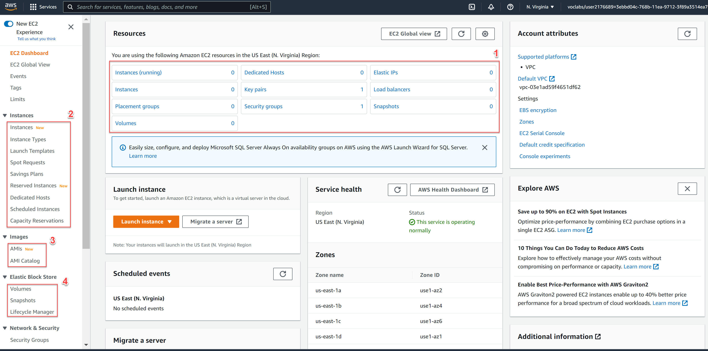
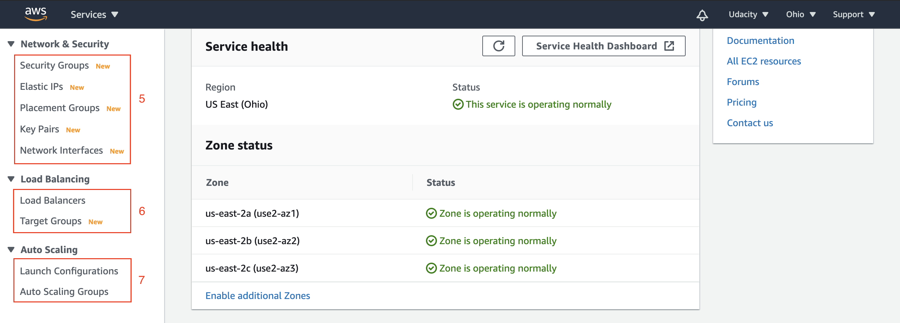
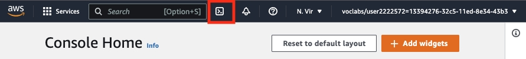
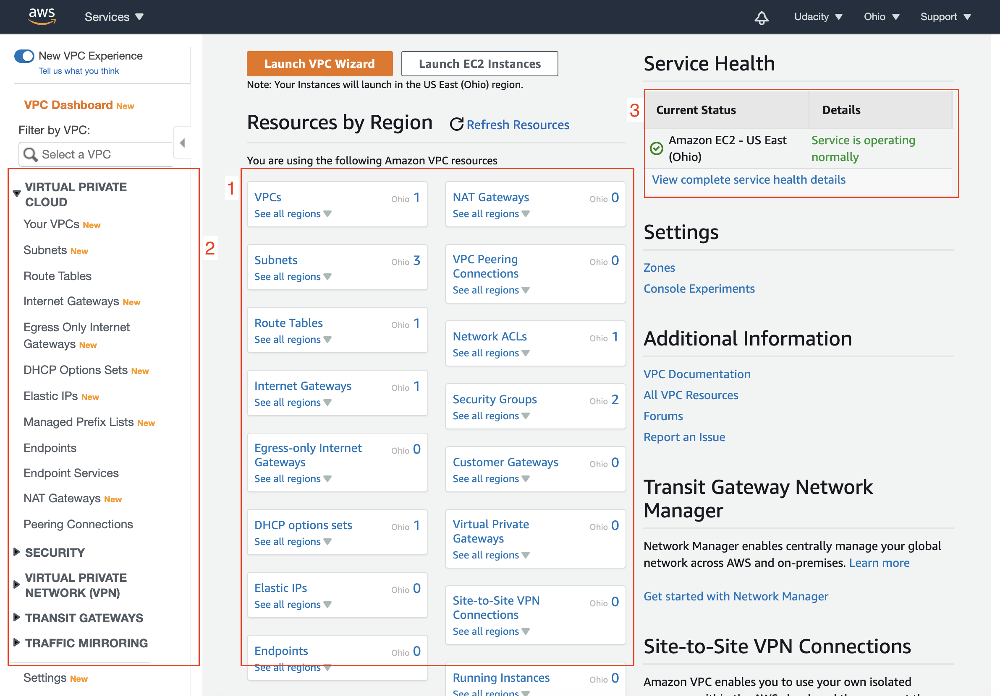

# Servers in the Cloud and Compute Services

## 1. Elastic Cloud Computing (EC2)
Elastic Cloud Compute or EC2 is a foundational piece of AWS' cloud computing platform and is a service that provides servers for rent in the cloud.



### 1.1 Resource Summary
It presents the summary of all the EC2 resources running in a particular region. A few of these resources, such as key-pairs, security groups, and load balancers are modular in nature, meaning, they can be re-utilized to launch another EC2 instance.

### 1.2 Instances
The simplest form of the EC2 Instance is the pay-as-you-go, also known as the on-demand instance. We've created this type of instance using the default Launch wizard available on the EC2 dashboard.
* **Instances** - It shows the list and details of the instances running in a given region.
* **Instance Types** - It shows the list of instance types (different combinations of hardware - CPU, storage, memory, architecture) available to launch a new instance.
* **Launch Templates** - These are the scripts that contain configuration information written either in JSON or YAML format to automate instance launches, simplify permission policies, and enforce best practices across your organization.
* **Spot Requests** - Spot is where you actually bid on an instance. If the price falls below your bid, the instance is automatically spun up and if the price goes above your bid, the server is automatically terminated. So this is good if you have an application that has a flexible start and stop time.
* **Saving Plans** - This is where you sign a contract for your EC2 Instance in either one to three years and you get a huge discount. So, this is good when you know the steady-state for your applications and you want to pay upfront.
* **Reserved Instances** – Reduce your Amazon EC2 costs by making a commitment to a consistent instance configuration, including instance type and Region, for a term of 1 or 3 years.
* **Dedicated Hosts** - This is where you have your own dedicated hardware. You may have license requirements for certain software packages that say no multi-tenancy. Meaning that you cannot run that application on a shared server. So Dedicated Hosts would solve that problem.
* **Capacity Reservations** - This allows you to reserve the desired capacity (count) of instances in a particular availability zone. The reserved capacity is charged at the selected instance type’s On-Demand rate whether an instance is running in it or not.

### 1.3 Images
AWS provides an option to create custom AMIs. Alternatively, you can use Images owned by Amazon and others. The AMI dashboard shows the Images owned by you. You can build a custom Image by using the EC2 Image Builder wizard available on this dashboard.

### 1.4 Elastic Block Store (EBS)
In simple words, you can think of EBS as an external hard drive that we attach to the server for additional storage.
* **Volumes** - The EC2 Dashboard shows the list and details of all the volumes currently available to use. You can re-purpose a volume, meaning, you can anytime attach or detach a volume to any instance. You can create new volumes by using the Create Volume wizard. AWS provides the option to have a variety of volumes, such as general-purpose solid-state drive (SSD), provisioned SSD, general hard-disk (HDD), throughput-optimized HDD, or magnetic drives. Each type of volume has a different serving capacity, such as the number of I/O operations per second.

    | Volume Type | Min (GB) | Max (GB) | I/O per sec |
    |---|---:|---:|---|
    | General Purpose SSD (gp2) | 1 | 16384 | [100 - 3000] IOPS |
    | General Purpose SSD (gp3) | 1 | 16384 | [3000 - 16000] IOPS |
    | Provisioned IOPS SSD (io1) and (io2) | 4 | 16384 | [100 - 64000] IOPS |
    | Cold HDD (sc1) | 500 | 16384 | Not applicable |
    | Throughput Optimized HDD (st1) | 500 | 16384 | Not applicable |
    | Magnetic (standard) | 1 | 1024 | 100 IOPS (avg) |

* **Snapshots** - A snapshot is the saved state of the data in the (existing) volume at a particular moment. Snapshots can be used to transfer volumes from one instance to another or saving the state for future use.
* **Lifecycle Manager** - It helps to schedule and manage the creation and deletion of EBS snapshots.



### 1.5 Network & Security
* **Security Groups** - A security group acts as firewall rules that control the traffic for EC2 instances or virtual private clouds (VPC). You can define multiple security groups. A given security group can be assigned to multiple EC2 instances. When you launch an instance, you can specify one or more security groups. You can modify the rules for a security group at any time; the new rules are automatically applied to all instances that are associated with the security group.
* **Elastic IP addresses** - An Elastic IP address is a static IPv4 address. Assume you have a server running on an EC2 instance, that has a specific IP address. In case, the instance fails, the back-up instance will spin up. The back-up instance will have a different IP address, which will require you to update the IP address used in your client application. This problem can be solved by using the elastic IP address. An Elastic IP address can mask the failure of an instance by remapping the current IP address to another instance in your account.
* **Placement Group** - You can imagine the EC2 instances as VMs running on the real servers in a data center. By default, the EC2 instances that you launch will be spread out across underlying hardware. But, sometimes there is a requirement to place the group of interdependent instances to meet the needs of your workload. AWS allows placing the instances based on either of the following placement strategies - cluster (tightly packed), partition (logically grouped), or spread evenly across the underlying hardware.
* **Key Pairs** - A key-pair is pair of (encrypted) public and (unencrypted PEM encoded) private keys. The public key is placed automatically on the instance, and the private key is made available to the user, just once. You can only log in to your running instance with the help of your private key.
* **Network Interfaces** - A network interface represents a virtual network card in a VPC, and it has a both private and public IP addresses. When you create an instance, a default network interface is attached to it. In this dashboard, you can create and attach additional network interfaces to any instance. An EC2 instance can have multiple network interfaces.

### 1.6 Load Balancing
* **Load Balancer** - A load balancer distributes the incoming traffic across multiple targets, such as EC2 instances, in one or more Availability Zones. AWS supports three types of load balancers:
        - Application Load Balancers
        - Network Load Balancers (new)
        - Classic Load Balancers (might become deprecated soon).

### 1.7 EC2 Auto Scaling
It is a service that automatically launches/terminates EC2 instances based on user-defined scaling policies, scheduled actions, and health checks. It ensures that you have a specified number of instances always up and running. You can specify the minimum and maximum count of instances. This service uses launch templates, i.e., a script containing the configuration details of the instances that will be launched automatically.

## 2. AWS Console
The AWS CLI (or Command Line Interface) allows you to access and control services running in your AWS account from the command line. To use the CLI:
* download, install, and configure it to your local machine
    - Creating a S3 bucket:
    ```bash
    aws s3api create-bucket  \
    -- bucket < name of the bucket goes here> \
    -- region < name of the region goes here>
    ```
    - Running an EC2 instance:
    ```bash
    aws ec2 run-instances --image-id ami-xxxxxxxx --count 1 --instance-type t2.micro --key-name
    ```
* preferably, use AWS CloudShell



Steps:
1. Install AWS CLI
```bash
curl "https://awscli.amazonaws.com/awscli-exe-linux-x86_64.zip" -o "awscliv2.zip"
unzip awscliv2.zip
sudo ./aws/install
```
2. Create an IAM user with Administrator permissions
3. Configure the AWS CLI
```bash
aws configure set aws_access_key_id "$AWS_ACCESS_KEY"
aws configure set aws_secret_access_key "$AWS_SECRET_ACCESS_KEY"
```
```bash
aws iam list-users
```
```bash
aws configure list
```

## 3. Elastic Block Store (EBS)
Elastic Block Store (EBS) is a storage solution for EC2 instances and is a physical hard drive that is attached to the EC2 instance to increase storage.

An Amazon EBS volume is a durable, block-level storage device that you can attach to your instances. After you attach a volume to an instance, you can use it as you would use a physical hard drive.

EBS is found on the EC2 Dashboard.

## 4. Security for Cloud Servers
Security in the cloud allows you to have complete control over your virtual networking environment.
* Configure your virtual network with public or private facing subnets.
* Launch your servers in the selected network to secure access.

### 4.1 Virtual Private Cloud (VPC)
Virtual Private Cloud or VPC allows you to create your own private network in the cloud. You can launch services, like EC2, inside of that private network. A VPC spans all the Availability Zones in the region.

VPC allows you to control your virtual networking environment, which includes:
* IP address ranges
* subnets
* route tables
* network gateways

When you create your first instance, a default VPC is gets created for you. Alternatively, you can create your custom VPC with user-defined subnets, route tables, internet gateways, and many other desirable configurations. To get started, let's have a walkthrough of the VPC Dashboard.



#### 4.1.1 Resource Summary
It shows the summary of VPC resources available under your account for each region. It includes VPC resources like subnets, route tables, internet gateways, endpoints, network ACL, and many more.

#### 4.1.2 Services under VPC
In the navigation on your left, you can see a categorized list of services that become a part of a VPC. Let's have an overview of a few key concepts:
* **Your VPCs** - It will list all your VPCs and display the deep-dive details of the selected VPC. Each VPC has a valid IPv4/IPv6 CIDR block allocated to it. Every resource in the VPC will have an IP address from the allocated CIDR block. Though, a few IP addresses reserved for special purposes.
* **Subnets** - It represents a subset of your VPC, i.e., a range of IP addresses from the CIDR block allocated to your VPC. Subnets of a VPC can be present in different AZs.
* **Route tables** - These are the set of rules, called routes, that determine to which IP address the network traffic should be directed.
* **Internet gateways** - If any of your resources within your VPC wants to communicate to the internet, then you must attach an internet gateway to your VPC. The internet gateway enables the communication between resources in your VPC and the internet.

#### 4.1.3 Service Health
The current status and details about the services in your VPC.

### 4.2 VPC - Network ACL
You can view the Network ACLs under the Security section in the left navigation pane of the VPC Dashboard.

1. **List of Network ACLs**: For each Network ACL in the list, view the ID, the count of associated subnets, whether it is a Default, the VPC Id to whom the network ACL is associated, and the owner ID.

2. **Details of the Selected Network ACL**: View the details of the selected Network ACL. In the snapshot above, it shows the details of a default Network ACL. Note that each VPC automatically gets associated with a modifiable default network ACL. Each subnet in your VPC must be associated with any one network ACL. Whereas, a given network ACL can be associated with multiple subnets.

Inbound/Outbound Rules
* The default network ACL allows all inbound and outbound IPv4 traffic, as shown in the snapshot above. However, you can create or edit the rules, anytime.
* Inbound/Outbound rules are numbered and ordered. The lowest numbered rule is evaluated first. In other words, the incoming/outgoing traffic to/from a given subnet follows the rules mentioned in the associated network ACL.
* Network ACLs are stateless in nature. Assume an inbound request arrived in your subnet. A "response" to the inbound request can only be sent out of the subnet if the outbound rules allow the outgoing traffic to the desired destination. A vice-versa scenario is also possible.

## 5. Lambda
AWS Lambda provides you with computing power in the cloud by allowing you to execute code without standing up or managing servers.

Tips:
* Lambda is found under the Compute section on the AWS Management Console.
* Lambdas have a time limit of 15 minutes.
* The code you run on AWS Lambda is called a “Lambda function.”
* Lambda code can be triggered by other AWS services.
* AWS Lambda supports Java, Go, PowerShell, Node.js, C#/.NET, Python, and Ruby. There is a Runtime API that allows you to use other programming languages to author your functions.
* Lambda code can be authored via the console.

Create Lambda Function
```bash
aws lambda create-function \
    --function-name MyFunction \
    --runtime nodejs18.x \
    --zip-file fileb://my-function.zip \
    --handler my-function.handler \
    --role arn:aws:iam::xxxxxxxxxxxx:role/service-role/MyFunction-role-tges6bf4
```

## 6. Elastic Beanstalk
Elastic Beanstalks is an orchestration service that allows you to deploy a web application at the touch of a button by spinning up (or provisioning) all of the services that you need to run your application.

Tips:
* Elastic Beanstalk is found under the Compute section of the AWS Management Console.
* Elastic Beanstalk can be used to deployed web applications developed with Java, .NET, PHP, Node.js, Python, Ruby, Go, and Docker.
* You can run your applications in a VPC.

Services that can be launch using Elastic Beantalk:
* VPC
* EC2 Instance
* Elastic Load Balancer

Perimission: `RoleForBasicEC2`