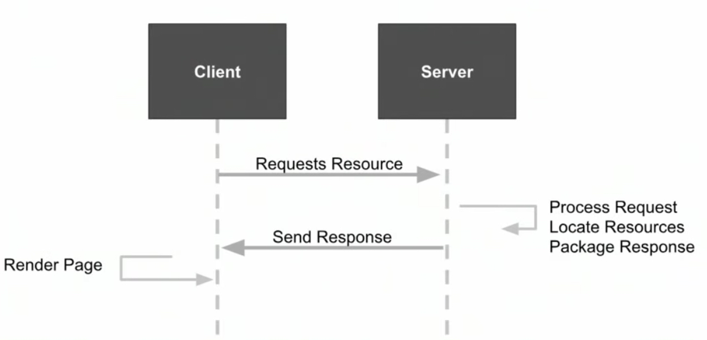
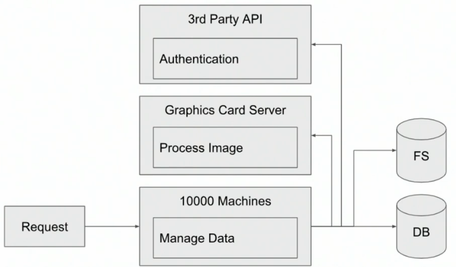
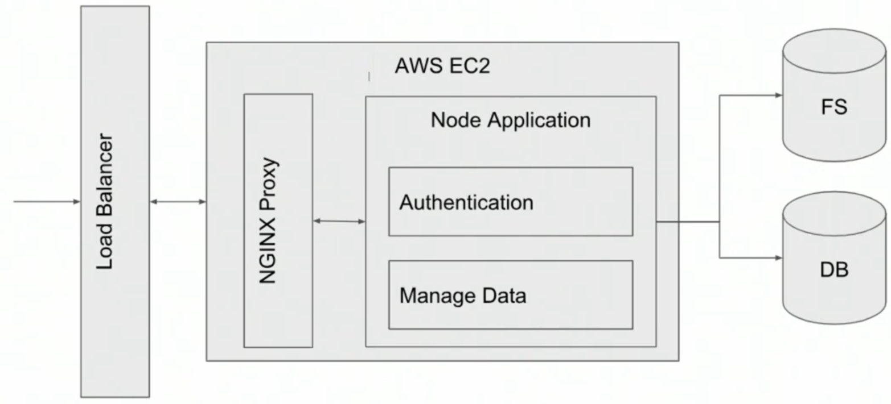
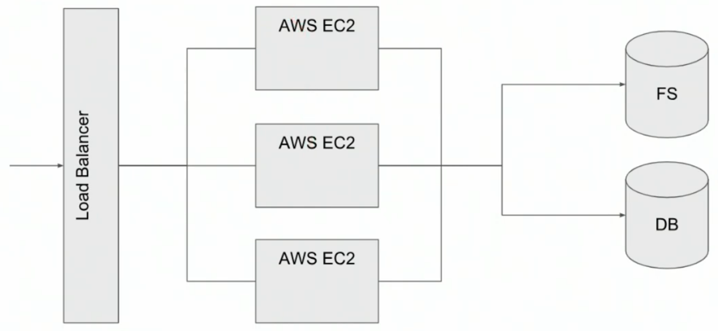

# Fullstack Apps AWS
## 1. REST API Development on AWS
### 1.1 The Client Server Paradigm
The client and the server need to communicate in a standardized way, ensuring that data can move back and forth seamlessly. This is where REST APIs come into play.



A URL consists of:
* protocol,
* subdomain and domain name,
* request path
* port
* query parameters

We know now that when a client sends a request to a server, the server processes that request and sends a response which contains:
* [status code](https://www.restapitutorial.com/httpstatuscodes)
    - 500 - Internal Server Error
    - 400 - Bad Request
    - 401 - Unauthorized
    - 403 - Forbidden
    - 404 - Not Found
    - 503 - Service Unavailable
* body
* headers

### 1.2 How to Design APIs
**Application Programming Interface (API)** - is a contract between two applications which specifies how they are going to communicate with each other.

**Endpoints** - are specific URLs that we can use to access resources or perform actions on a server.

**REST** - is an architectural style used for manipulating resources over the Internet. In order for an API to be RESTful it needs to fulfil couple of requirements:
* **Client-server** - it needs to follow client-server communication model
* **Uniform interface** - it needs to provide a uniform interface for all resources
* **Stetelessness** - REST requests should include all the information necessary for their processing
* **Cacheability** - whenever possible it should be possible to cache resources on the client or server
* **Layered system architecture** - every request might go through multiple layers before it gets processed but neither the client nor the server should be aware of other layers. For instance there might be a load balancing or security layer before the request reaches the server.

By using different request methods we can perform different actions on server resources such as retrieve, add, modify, or delete them.

REST Methods:
* `OPTIONS` - for identifying responsiveness and getting allowed request methods
* `GET` - for fetching resources
    
* `POST` - for creating resources in non-idempotent way. POST request executed N times will result in N resources being created.
    
* `PUT` - for creating a single resource which is already a part of the resource collection. PUT is idempotent meaning that N same requests will still result in a single resource being created.
* `PATCH` - for updating resources
    
* `DELETE` - for deleting resource
    

Best Practices:
* only use nouns and no verbs
* nouns should be plural and consistent `{{host}}/api/cars/5`
* all requests and responses should include Content-Type header e.g. `application/json`
* error payloads should include error codes or messages explaining to the client the reason why the request failed

### 1.3 Monolithic vs. Loosely Coupled System
A **monolithic system** is a software application where all its parts are built and run together as one single unit. A monolithic system is a tightly coupled application where all parts work together as one unit, making it quick to build initially but potentially creating technical debt—extra time and resources needed to rework the code later.

Advantages of **Loosely Coupled Systems**:
* **Single Responsibility Principle** - it is easier to design a loosely coupled system where each component takes care only of its own job without overlapping with other parts of the system.
* **Scalability** - loosely coupled systems are scalable by design. Their components are smaller and independent, which allows for the scaling of each one of them according to its individual needs.
* **Lower technical debt** - loosely coupled systems are easier to maintain and refactor over time.
* **Better fault tolerance** - a failure of one component does not cause failure of the other parts of the system.
* **Easier development** - this point is especially relevant for big projects with many people working on them simultaneously. When the system is not tightly coupled, different teams can work in parallel on different parts of the system, which speeds up the process and allows the utilization of people with different specializations effectively.
* **Testability** - in a loosely coupled system, each component can be tested individually.

**Microservice architecture** is a special kind of loosely coupled system in which our application gets divided into small, independent services, communicating with each other in order to achieve a common goal. Each of the services has its own purpose in the system, and together they comprise the system as a whole.



## 2. Developing with AWS Databases and Storage
### 2.1 Databases
**Relational databases** are perfect when your data has a predefined structure and it includes many complex relationships between different entities. It is also the best solution if your system requires database transactions and strong consistency.

**NoSQL Databases**
NoSQL is an umbrella term for all non-relational databases. Some most popular types on NoSQL databases include:
* **Key-Value databases** - store data as a collection of key-value pairs. They are simple and easily scalable but do not provide complex data relationships.
* **Document databases** - store data as JSON, BSON or XML documents rather than rows and tables. They offer flexible schema and high performance but may not allow for complex queries.
* **Graph databases** - store data as nodes in a graph. They are perfect for representing data with many connections such as social networks, AI knowledge graphs, recommendation engines etc.
* **Columnar databases** - store data by columns, rather than by rows which allows for fast retrieval of huge amount of data of the same type which is especially useful in analytical applications.

Because the underlying data structure is much simpler than in relational databases NoSQL solutions are easier to scale horizontally.
### 2.2 Storage
**Object or File storage solutions** are perfect for storing BLOBs Binary Large Objects. It is generally cheaper and often faster than databases but does not provide the same table structure, transactions, etc. as databases. It is also good for archiving data. In AWS Object Storage solution is called **Simple Storage Service (S3)**. S3 utilizes the concept of **buckets**, which is a simple directory-like system.

## 3. Deploying Applications on AWS
**Elastic Beanstalk** is a powerful Development Operations tool (DevOps) that allows you to easily deploy your code to AWS and create the required infrastructure with minimal effort.



scale out:


## 4. Securing AWS Applications
### 4.1 Intro
Security is a critical aspect of full-stack application development. Here are the key areas that need to be secured:
* **User Authentication**: This involves verifying the identity of users. Techniques such as password hashing, two-factor authentication, and session management are used to ensure that only authorized users can access the application.
* **Data Encryption**: Any sensitive data, such as user passwords, should be encrypted both in transit and at rest. This ensures that even if data is intercepted or accessed, it cannot be read without the correct decryption key.
* **API Security**: APIs are often used to transmit data between the server and client. They need to be secured to prevent unauthorized access. Techniques include using secure tokens, validating input data to protect against attacks like SQL injection, and rate limiting to prevent abuse.
* **Database Security**: Databases often store sensitive data. They should be secured to prevent unauthorized access and data leaks. This can involve encrypting data and using secure database configurations.

### 4.2 Storing Passwords
One Way Hash
* `bcrypt`
* `scrypt`
* `SHA-1`
* `MD5`

### 4.3 User Authentication
**Authentication** is the process of verifying who the user is while **authorization** is the process of verifying what permissions the user holds.

| Cookie based authentication | Token based authentication |
|---|---|
| User logs in | User logs in |
| Server generates an access token and stores it in the database associated with that user | Server generates an access token and signs it with a private key |
| Server attaches the access token to a response cookie to be returned to the client | Server returns the signed token in a response body |
| The cookie is automatically attached by the browser to every request between the client and the server | The client stores the token and adds it to every consecutive request requiring authentication |
| On every consecutive request, the server validates the user's session based on the cookie | The server validates the user's session by validating the token using a public key |
| **Problems** | **Problems** |
| Cookies are sent automatically by the browser, even for requests that do not require authentication | You have to store the token somewhere manually, while cookies are stored out of the box. Options include in-memory storage, `localStorage`, `sessionStorage`, and cookies |
| Cookies are bound to a single domain, so if your app makes requests to multiple services, you might need to use a reverse proxy | Slightly more prone to XSS (Cross-Site Scripting) attacks, as it is easier to steal the token than an HTTP-only cookie. However, malicious scripts can still make requests on your behalf containing the cookie |
| Vulnerable to XSRF/CSRF (Cross-Site Request Forgery) attacks | — |

**JWT**
* The most popular token structure currently used in IT systems is JWT - JSON Web Token. It is an open standard for transmitting information securely as JSON object.
* JWTs can be signed using a secret (with the HMAC algorithm) or a public/private key pair using RSA or ECDSA.
* 
The JWT contains a header, payload and a signature. You can put whatever information you need in the payload and be sure that noone can modify it without access to your private key/secret.
* JWTs can be additionaly encrypted if needed.
* Example:
    ```
    // header
    {
    "alg": "HS256",
    "typ": "JWT"
    }

    // payload
    {
    "sub": "1234567890",
    "userId": 123,
    "name": "John Doe",
    "admin": true
    }

    // signature
    HMACSHA256(
    base64UrlEncode(header) + "." +
    base64UrlEncode(payload),
    secret)
    ```

### 4.4 Storing Secrets
When it comes to storing credentials in the cloud, there are three main options:
* **Environment variables** - This is the most straightforward solution. You can configure them in your Elastic Beanstalk environment. However, the problem with this approach is that you cannot share environment variables across multiple environments, and anyone with access to your environment can easily view the secrets.
* **Systems Manager Parameter Store** is an AWS service designed to store secrets and configurations as key/value pairs. It can store both plain text as well as encrypted values.
* **AWS Secret Manager** - It is very similar to Parameter Store. It was designed specifically for storing secrets. The difference is that in Secret Manager, encryption is enabled by default, and it provides some additional features such as secrets rotation or cross-account access. Secret Manager is more expansive than Parameter Store, so if your use case does not require any of the additional features, Parameter Store might be a better option.

## 5. AWS Frontend Development
Axios is a popular, promise-based HTTP client that works both in the browser and in a node.js environment. It provides a single API for dealing with XMLHttpRequests and node's HTTP interface. In this application, Axios is used to create an instance of an HTTP client (backendClient) with a specified base URL and default headers.
* `backendClient`: This is an instance of Axios with a base URL of the backend service. The base URL is fetched from an environment variable REACT_APP_BACKEND_URL. This client is used to make HTTP requests to the backend service.
* `AuthClient`: This is a class that uses the backendClient to make a POST request to the /auth/token endpoint. It sends the user's email and password in the request body. If the authentication is successful, the backend service returns an access token.
* `TweetsClient`: This is another class that uses the backendClient to make a GET request to the /tweets endpoint. It sends the access token in the Authorization header. If the request is successful, the backend service returns a list of tweets. 