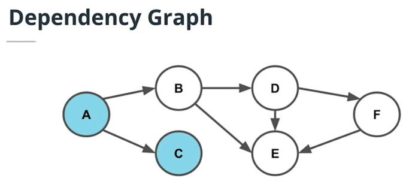

# Microservices Design Principles & Best Practices
What are microservices?

Architectural style where our application is composed of modules that can be independently developed and deployed.

## 1. Monolith vs. Microservices
* Microservices are an architectural style where an application is composed of modules that can be independently developed and deployed.
* In monoliths, all the components of the application are built into a single application.

Microservice Benefits:
* **Scale** Lean applications that are able to tailor their logic and infrastructure to their specific business needs. More-easily architected for horizontally scaling.
* **Development in Parallel** Teams can develop and deploy their own codebases.
* **Cost-Effectiveness** Utilize resources only for what is necessary for the specific microservice.
* **Flexibility** Choose technologies that make the most sense for the team and business.

Microservice benefits are not free! Using microservices requires extra time for set-up and managing the independent parts.

## 2. Microservices Design Principles
Properties of Microservices:
* Communication
    - Services communicate through a network
    - REST is currently the most-commonly used network interface.
* Independently Deployed
    - Deployment to one service should not affect another
* Fault tolerant
    - Diligence in writing code that can anticipate when another microservice isn’t working

| Term | Definition |
|---|---|
| REST | Architectural style of communication across a network |
| Fault Tolerance | The ability to continue operating in the event of a failure |
| Vertical Scaling | Scaling by increasing the capacity of existing machines |
| Horizontal Scaling | Scaling by adding more machines |

## 3. Divide into Microservices

| Term | Definition |
|---|---|
| Dependency Graph | A diagram that maps out the relationships between components to understand which parts of the system rely on the other |
| Module | Program that is logically grouped together to execute a specific functionality |
| Strangler Pattern | Strategy of refactoring code by incrementally replacing components of the codebase |
| Technical Debt | The concept of choosing an easier implementation of software that will need to be reworked |

## 4. Additional Considerations
**Trade-Offs**

Designing software is not a binary process. There's rarely a right or wrong answer and it's often a decision of balancing both technical and business tradeoffs. Some trade-offs include:
* Cost of Infrastructure
* Time of Development
* Managing Technical Debt

**Scope of Refactor**

Microservices may not just be refactoring code. We also need to also consider other parts of the system including databases and infrastructure.