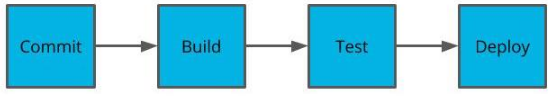
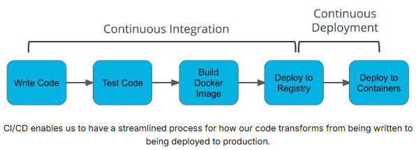

# Automating the Application Development Lifecycle
## 1. Why we use Deployment Pipelines
Understanding Deployment Pipelines:
* We now have industry standards and tools for how we can deploy our code.
* Docker containers simplify what we deploy.
* Deployment pipelines simplify how we deploy Docker containers.
* Code is often deployed multiple times to different environments to validate functionality and minimize bugs.
* Deployment pipelines enable us to have an automated process that is reliable and reproducible.



A deployment pipeline may contain stages for committing, building, testing, and deploying code.

## 2. Best Practices for Deploying Code
**Code After Coding**

Once your code is done, how do you ship it? Typically, the software development cycle will proceed with building the code, installing all of the dependencies, running automated tests, manually testing, and then repeating for each development environment the application needs to be deployed to.
* It’s a common fallacy to underestimate the time it takes to deploy code.
* Teams deploying enterprise software often involves many internal and external dependencies that may include: infrastructure changes, security changes, permissions provisioning, load testing.

## 3. Understanding CI/CD
* **Continuous Integration**: Process in which code is tested, built into a Docker image, and deployed to a container registry. Practice of streamlining developer code to a centralized source.
* **Continuous Deployment**: Process in which our Docker image is deployed to containers. Practice of streamlining how code is released.



[Ship Early & Often](https://www.ycombinator.com/blog/tips-ship-early-and-often/)

## 4. CI Tools
* **Jenkins** - most flexible but more overhead of setup.
* **CircleCI** - alternative to Travis CI with many competing features.
* **AWS CodeBuild** - integrates easily with other AWS tools.

### 4.1 Travis
Using [Travis](https://www.travis-ci.com/) for Continuous Integration:
* Travis is a tool that helps us with the CI process.
* Travis integrates with your application using a YAML file.
* YAML files are often used to specify configurations.
* Travis can be used to build and push images to DockerHub.

Travis File: The Travis file is always named `.travis.yml` and stored in the top-level of your git directory. This is detected by Travis CI and turned into a build pipeline. Example:
```yaml
language: node_js
node_js:
  - 13

services:
  - docker

# Pre-testing installs
install:
  - echo "nothing needs to be installed"

# Scripts to be run such as tests
before_script:
  - echo "no tests"

script:
  - docker --version # print the version for logging
  - docker build -t simple-node .
  - docker tag simple-node YOUR_DOCKER_HUB/simple-node:latest

after_success:
  - echo "$DOCKER_PASSWORD" | docker login -u "$DOCKER_USERNAME" --password-stdin
  - docker push YOUR_DOCKER_HUB/simple-node
```

**Enviornment Variables**

Environment variables are a useful way to handle variables that shouldn’t be hard-coded into our application. These values are often credentials that shouldn’t be stored in the code.

Travis provides a way to set environment variables without having them exposed. These values will be used during the Travis build process.
* In your TravisCI dashboard, navigate to a repository.
* Navigate to the Settings screen.
* Set values in Environment Variables.

### 4.2 CircleCI
The `.circleci/config.yml` file is the configuration file used by CircleCI to define the workflows, jobs, and steps for building, testing, and deploying your application. Here are some constructs you can use while writing a `.circleci/config.yml` file:
* **Version declaration**: Start your configuration file with a declaration of the version of the CircleCI configuration syntax you are using. The current version is 2.1.
* **Jobs**: Define one or more jobs that specify the steps needed to build, test, and deploy your application. Each job consists of a set of steps that run in order.
* **Workflows**: Define a workflow that specifies the order in which jobs should run. You can use the requires keyword to specify dependencies between jobs.
**Environment Variables**: Declare environment variables that you need to use within your jobs. We strongly encourage you to read through this document to know different ways to use the environment varibales.
* **Commands**: Define custom commands that you can reuse across multiple jobs.
* **Executors**: Define an executor to specify the environment in which jobs will run, such as the version of a programming language or other dependencies.
* **Parameters**: This section allows you to define parameters that can be passed to jobs and workflows.