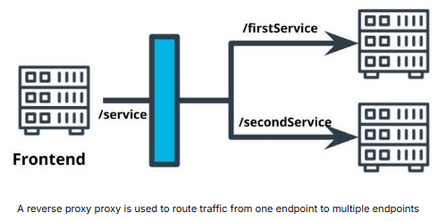

# Best Practices/Designs for Kubernetes in Production
## 1. Configuring a Cluster
Kubernetes has configurations that can be tuned to optimize your deployed application:
* Cost:
    - Configure the resources and replicas for our deployed applications.
* Security:
    - Configure who has access to the Kubernetes pods and services.
    - Secure traffic for least-privilege.

## 2. Thinking about Production
Deployed applications for production-use are different than ones we use for development. We have to make additional considerations as the application is no longer running in our isolated environment.
* **Restrict Access**: Follow properties of least-privilege to secure our application.
* **Scale**: Be able to handle the number and size of user requests.
* **Availability**: Ensure that the application is responsive and able to be used when needed.

## 3. Reverse Proxy
**Reverse Proxy**:
* A single interface that forwards requests on behalf of the client and appears to the client as the origin of the responses.
* Useful for abstracting multiple microservices to appear as a single resource.
* The proxy gives you useful production features such as HTTPS termination, load balancing, routing, request limits, and hiding internal application servers.
```
Internet
   │
   ▼
Reverse Proxy
   │
   ▼
FastAPI/Uvicorn
```


**API Gateway**: A form of a reverse proxy that serves as an abstraction of the interface to other services.
* [AWS API Gateway](https://aws.amazon.com/api-gateway/)
* [Microservices with API Gateway](https://www.f5.com/products/nginx#overview)

**Sample Reverse Proxy**
* Nginx is a web server that can be used as a reverse proxy. Configurations can be specified with an `nginx.conf` file.
* Sample bare-bones `nginx.conf` file:
    ```
    events {
    }
    http {
        server {
            listen <PORT_NUMBER>;
            location /<PROXY_PATH>/ {
                proxy_pass http://<REDIRECT_PATH>/;
            }
        }
    }
    ```

## 4. Securing Microservices
**AWS security groups** - enables you to restrict the inbound and outbound traffic for AWS resources.
 
**Kubernetes Ingress and Egress** - enables you to restrict the inbound and outbound traffic for Kubernetes resources.
* **Ingress**: Inbound web traffic.
* **Egress**: Outbound web traffic.

Reading:
* [What is penetration testing?](https://www.cloudflare.com/learning/security/glossary/what-is-penetration-testing/)

## 5. Scaling & Self-Healing
Kubernetes deployments can be set up to recover from failure:
* **Health checks** - an HTTP endpoint that must return a `200` response for a healthy status. Kubernetes will periodically ping this endpoint.
* **Replicas** - Kubernetes will attempt to maintain the number of desired replicas. If a pod is terminated, it will automatically recreate the pod.
* **Horizontal Pod Autoscaler (HPA)** - A deployment feature that allows additional pods to be created when a CPU usage threshold is reached.
* **Liveness Probe** - A monitoring activity that occurs at scheduled intervals to ping a health check API endpoint to validate that the application is in a healthy state.
* **Resilience** - The property of an application to handle and recover from failures.

**Why Choose Horizontal Scaling over Vertical Scaling with Microservices?**
* Horizontal scaling is not more performant than vertical scaling. Horizontal scaling and vertical scaling are different techniques to achieve the same goal.
* Vertical scaling is compatible with reverse proxies. Reverse proxies don't care whether we use vertical or horizontal scaling because the pods are abstracted behind a service.
* Horizontal scaling is more cost effective because servers are subject to diminishing returns: the more we improve the performance of a single server, the more it will cost.


## 6. Using Logs
* Software is rarely free of errors so we need to troubleshoot errors when they occur.
* In production environments we don't have tools like breakpoints that could help us identify bugs.
* Logging can get complicated so we need tools to handle logs and make it easy to search them.
* System logs used for debugging are sometimes different from error messages returned by API's.

**Strategies for Logging**:
* Use timestamps to know when the activity occurred.
* Set a consistent style of logging to make it easier to parse log output.
* Use process IDs to trace an activity.
* Rotate logs so they don't fill up your storage.
* Include stack traces in your logs.
* Look at the delta in message timestamps to measure execution time.

Reading:
* [Netflix Scalable Logging and Tracking](https://netflixtechblog.com/scalable-logging-and-tracking-882bde0ddca2)
* [Designing a Logging Strategy](https://docs.oracle.com/cd/E19424-01/820-4806/fyfcv/index.html)

Definitions:

| Logging Strategy | Benefit |
|---|---|
| Timestamp | Understand the time an event occurred. |
| Logging Format | Make it easier to ingest and parse errors. |
| Log Rotation | Prevents running out of disk space. |
| Stack Traces | Provides a detailed synopsis on the error. |
| Log Deltas | Provides the time it took to execute a request. |

**Execution Time of an API Request**
* Imagine that there are multiple requests per second hitting the same API endpoint. Our load balancer will distribute these requests to a replicas. Since replicas are running the same Docker images, they'll produce very similar logs as they execute the same line of code. If we look at our logs, it'll be hard to determine which line belongs to which request.
* To alleviate this, we can assign a unique ID at the beginning of the request and use that ID to identify the activityfrom beginning to end.