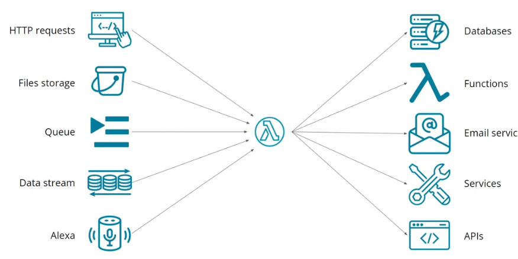
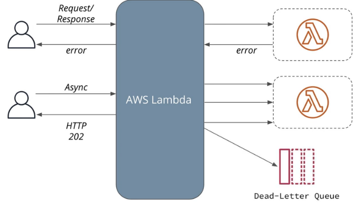
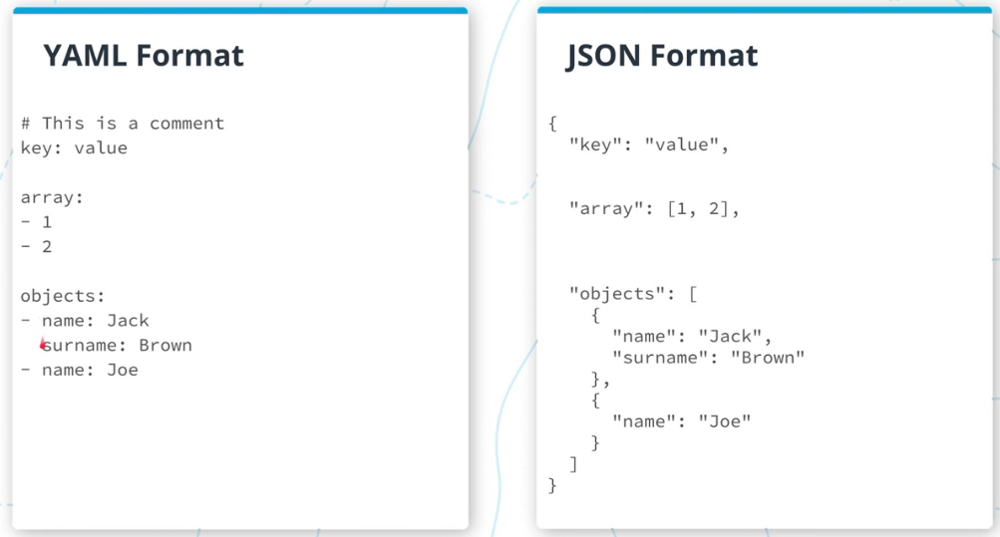
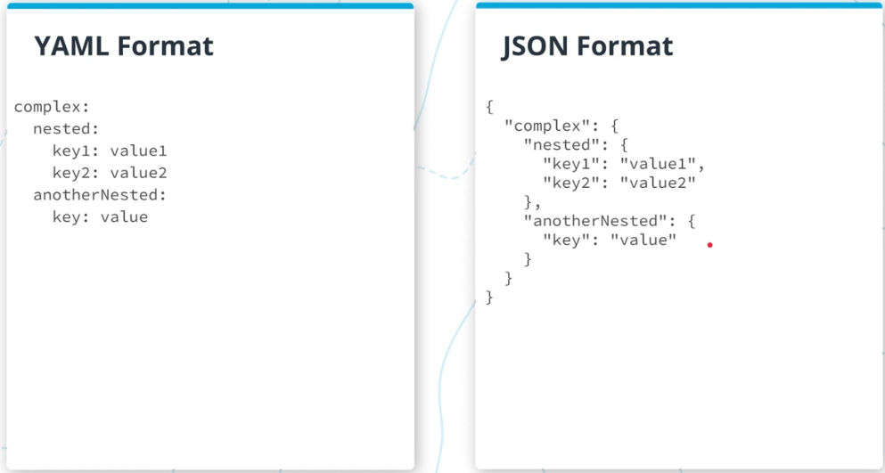

# Introduction to Serverless
## 1. Function as a Service (FaaS)
* **FaaS (Function as a service)**: write code in individual functions and deploy them to a platform to be executed.
* **Datastores**: Storage of data.
* **Messaging**: Send messages from one application to another.
* **Services**: Services that provide functionalities where we don't need to manage servers, i.e. authentication, ML, video processing.

Function as a Service:
* Split application into small functions
* Event driven
* Pay per invocation
* Rest is handled by a cloud provider



## 2. AWS Lambda
* **AWS Lambda** is a computing service that runs code in response to events from Amazon Web Services.
* A **Lambda function** is a single function connected to an event source running in AWS Lambda.

AWS Lambda has two main configuration parameters:
* **Memory**
    * Sets the maximum RAM available to the function.
    * More memory also provides more CPU power, improving performance.
    * More memory increases the cost per execution.
* **Timeout**
    * Sets the maximum time a function can run.
    * If the timeout is exceeded, AWS automatically terminates the function.

AWS Lambda limitations:
* At most 10GB of memory per execution.
* Functions can run no more that 15 minutes.
* Can only write files to `/tmp` folder.
* Limited number of concurrent executions.
* Event size up to 6 MB.
* At most 1,000 concurrent executions by default.

## 3. How FaaS Work
When we send a request to execute a Lambda function, AWS Lambda creates an environment to run that function.
1. It starts a container for the specific environment and loads the function code into the environment.
2. It sends an event to our function.
3. The same process is repeated for all the other requests coming in.

## 4. Debugging Lambda Functions
Two main tools to troubleshoot lambda functions are:
* **Metrics**: Using the metrics AWS collects we can see how many times our function was called, how many errors were there, etc
* **Logs**: Using the logs that AWS collects for each Lambda call provides the ability to inspect these logs to try to debug any errors

## 5. Invocation Types
3 invocation types:
* Request/response
* Asynchronous invocation
* Using AWS CLI

Errors are handled differently, depending on how we execute our function:
* When we use a Request/response method: If there's an error in the function, it will return immediately to the caller, which can process the error from the Lambda function.
* When we use an Async method: Instead of returning an error to the user, AWS Lambda will return HTTP 202 code to the user and store a request into an internal queue. Additionally, it will try to call the Lambda function up to 3 times. If all of those times result into an error, then it will store the event into a "dead-letter queue," which stores all the events that the Lambda function failed to process.



## 6. JavaScript Callbacks
Async/await can only be used in an asynchronous function. An asynchronous function is identified by the `async` prefix.

## 7. Additional Parameters
`context` parameter provides information about the environment in which our lambda function is executed. It has the following fields:

| Field | Description |
|---|---|
| `functionName` | Name a function |
| `functionVersion` | Specific version of a function |
| `memoryLimitInMB` | Maximum amount of memory available |
| `logGroupName` | Log group for the function |
| `logStreamName` | Log stream for the function |
| `getRemainingTimeInMillis()` | Get remaining time in ms |

## 8. YAML
* Serverless framework configuration is in YAML format.
* Superset of JSON.
    - A valid JSON is a valid YAML file.
    - YAML provides additional features.
    - More concise format.
* Indentation with spaces (like python).





Check: www.bairesdev.com/tools/json2yaml/

## 9. Configure Serverless Applications
To define an application using Serverless Framework several components may be used:
* Define the lambda functions
* Implement events
* Define AWS resources
* Include plugins for additional functionality

### 9.1 Project Structure:
```
.
├── node_modules/
│   └── plugins, prod. and dev. dependencies
├── src/
│   └── function.js
├── serverless.yml
├── package.json
└── package-lock.json
```

### 9.2 `serverless.yaml` Structure:
* **Provider**
  - Provides the provider-specific configuration.
  - For example, if we use **AWS**, we'll specify AWS-specific configuration here.

* **Functions**
  - Defines the list of functions we will have in our application.

* **Plugins**
  - Allows us to extend the functionality of the **Serverless Framework**.
  - Plugins can add functionality that doesn't exist in the Serverless Framework out of the box.

- **Resources**: Allows us to add additional cloud resources, such as:
    - Databases
    - S3 buckets
    - Other cloud resources

```YAML
service: serverless-app

frameworkVersion: '3'

provider:
  name: aws
  runtime: nodejs16.x
  region: 'us-east-1'

  # Environment variables available to all Lambda functions
  environment:
    SERVICE_NAME: example
    URL: https://example.com

  # IAM permissions for Lambda functions
  iam:
    role:
      statements:
        # Allow Lambda functions to publish custom CloudWatch metrics
        - Effect: Allow
          Action: 'cloudwatch:PutMetricData'
          Resource: '*'

functions:
  # Lambda function name
  OnImageUpload:
    # File path: src/images
    # JavaScript function name: handler
    handler: src/images.handler

    # Events that trigger the Lambda function
    events:
      # Trigger when an event occurs in the "images" S3 bucket
      - s3: images

plugins:
  - serverless-webpack

resources:
  Resources:
    # CloudFormation definition in YAML
```

### 9.3 Supported Events
* API Gateway - REST API
* SQS - Simple Queue Service
* Alexa - for voice applications
* CloudWatch Events - scheduling events
* CloudWatch Logs - process log events
* Kinesis, DynamoDB - process a stream of updates
* SNS - simple notification service