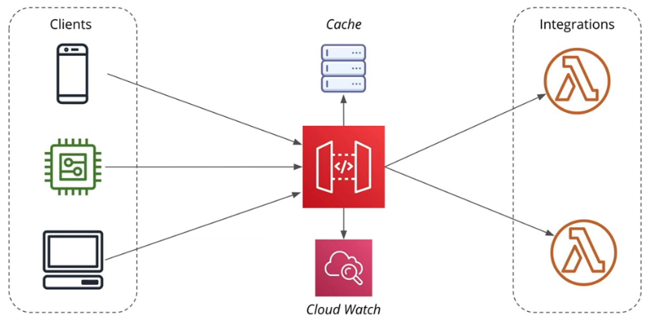
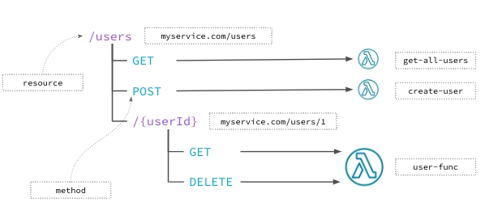
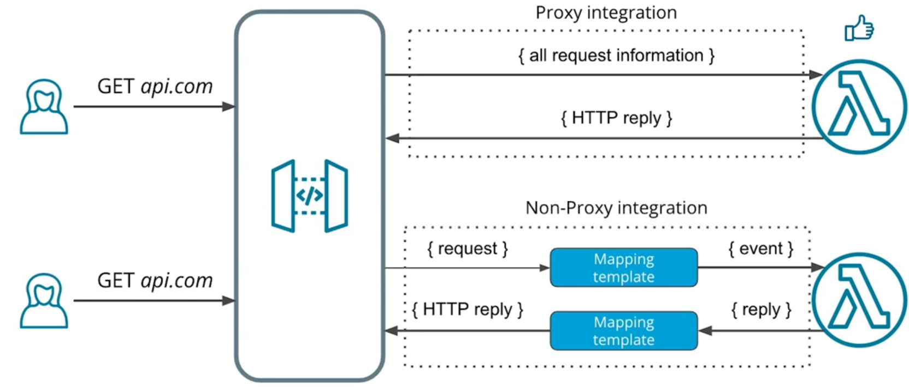
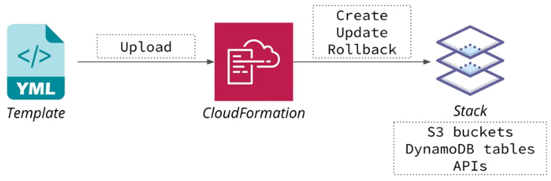

# REST API

## 1. API Gateway
When implementing REST API with AWS Lambda our functions receive HTTP requests in the form of events. Each event contains information like HTTP method, HTTP body, headers, etc.

A Lambda function should process this event and return a response that will be converted by AWS into an HTTP response.

What is API Gateway:
* Entry point for API users
* Pass requests to other services
* Process incoming requests



### 1.1 API Gateway Targets
Possible targets for an HTTP request processed by API Gateway:
* Lambda Function - call a Lambda function
* HTTP Endpoint - call a public HTTP endpoint
* AWS Service - send a request to an AWS service
* Mock - return a response without calling a backend
* VPC Link - access resource in an Amazon Virtual Private Cloud (VPC)



### 1.2 API Gateway Configurations
**EndPoint Configurations**

There are three primary types of endpoint configuration:
* Configured per API
* Public
    - Edge Optimized Endpoint
    - Regional Endpoint
* Private VPC

Lambda integration modes
* **Proxy** - passes all request information to a Lambda function. Easier to use.
    - HTTP request event
    ```json
    {
    "path": "/users/1",
    "headers": {
        "Accept": "application/json"
    },
    "httpMethod": "GET",
    "pathParameters": {
        "userId": "1"
    },
    "body": ""
    }
    ```
    - HTTP reply
    ```js
    exports.handler = async (event) => {
    return {
        statusCode: 200,
        headers: {
        "Cache-Control": "max-age=120"
        },
        body: JSON.stringify({
        "result": 42
        })
    }
    }
    ```
* **Non-proxy** - allows to transform incoming request using Velocity Template Language.



### 1.3 API Gateway Stages
* dev stage: api-gateway.com/dev
* staging stage: api-gateway.com/staging
* prod stage: api-gateway.com/prod

## 2. Cloud Formation
CloudFormation is a services for creation and management of AWS resources. CloudFormation allows us to: 
* Write YAML/JSON config file.
* Changes state of AWS resources.
* Version control the infrastructure.
* CloudFormation is free and we only need to pay for created resources.

